# Data Analytics Portfolio — Health & Patient Flow

**Yizhou Liu — Health Data Analyst (Sydney).** SQL · Python · Power BI · R.
Each project runs end-to-end: **data → SQL → analysis → dashboard → recommendations.**

> **Featured project:** an Emergency Department & Patient-Flow analysis on 54,837
> synthetic ED presentations, modelling the metrics Australian health services
> actually track (NEAT 4-hour target, triage performance, LWBS, 28-day
> readmissions). Full project folder → **[`healthcare-ed-analytics/`](healthcare-ed-analytics)**
> · [SQL](healthcare-ed-analytics/sql) · [Power BI guide + DAX](healthcare-ed-analytics/dashboard)
> · [Recommendations](healthcare-ed-analytics/docs/business_recommendations.md)

---

# Emergency Department & Patient Flow — Analysis Report

A walkthrough of 54,837 ED presentations and 11,045 inpatient admissions
(synthetic, FY2024–25). Every figure is reproduced by
[`eda.py`](healthcare-ed-analytics/analysis/eda.py) from the data in
[`healthcare-ed-analytics/data`](healthcare-ed-analytics/data). Numbers in the
text are computed directly from the dataset.

### 📊 Summary dashboard

*Built with Python + matplotlib. A step-by-step [Power BI build guide](healthcare-ed-analytics/dashboard/powerbi_build_guide.md)
with all [DAX measures](healthcare-ed-analytics/dashboard/dax_measures.md)
reproduces the same views as an interactive `.pbix`.*

**Contents**
1. [Demand — how much, and when](#1-demand--how-much-and-when)
2. [Access & timeliness — the 4-hour target](#2-access--timeliness--the-4-hour-target)
3. [Arrival patterns & staffing](#3-arrival-patterns--staffing)
4. [Quality — patients who leave](#4-quality--patients-who-leave)
5. [Admissions & inpatient flow](#5-admissions--inpatient-flow)
6. [Readmissions](#6-readmissions)
7. [High utilisers](#7-high-utilisers)
8. [Conclusions](#8-conclusions)

---

## 1. Demand — how much, and when

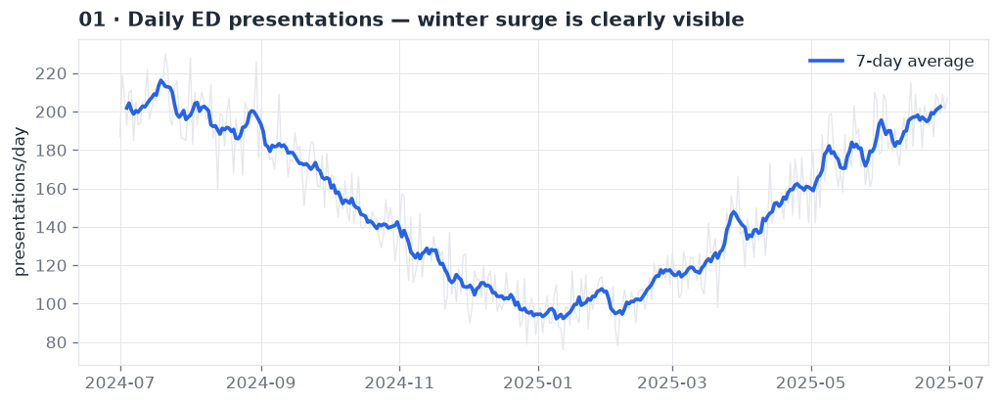

Presentations average ~150/day but swing seasonally. The 7-day average makes a
**winter surge (Jun–Aug)** unmistakable — demand rises roughly 50% above the
summer baseline. Because it is seasonal and recurring, it is *plannable*.

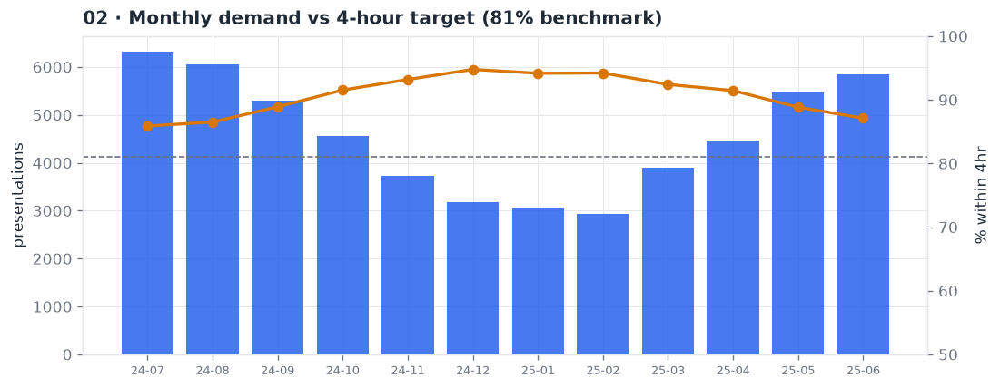

Overlaying monthly volume with the 4-hour target performance shows the two move
in opposition: as winter volume climbs, the share of patients seen within four
hours **falls below the 81% benchmark**. Demand is the lever on performance.

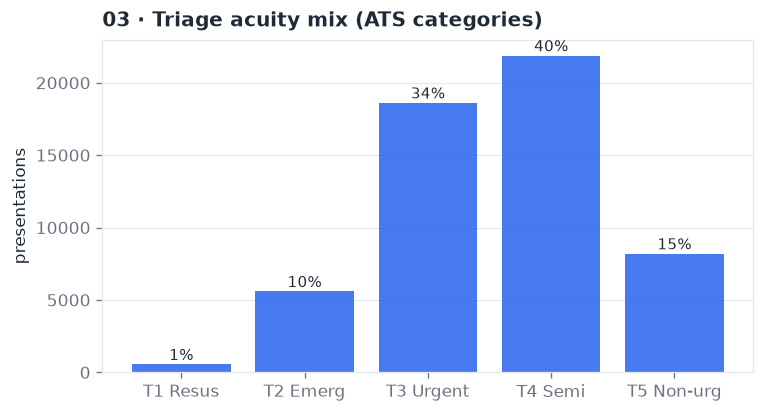

The acuity mix is typical of a mixed metropolitan ED: **~75% of presentations are
lower-acuity (T4–T5)**, but the smaller high-acuity group (T1–T2, ~11%) drives
most of the clinical risk and inpatient demand (see §5).

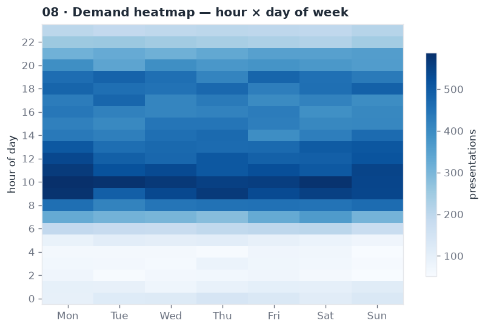

Demand concentrates **09:00–20:00 on weekdays**, peaking mid-morning. Overnight
(00:00–06:00) is consistently quiet. This hour × day signature is the basis for
demand-matched rostering.

## 2. Access & timeliness — the 4-hour target

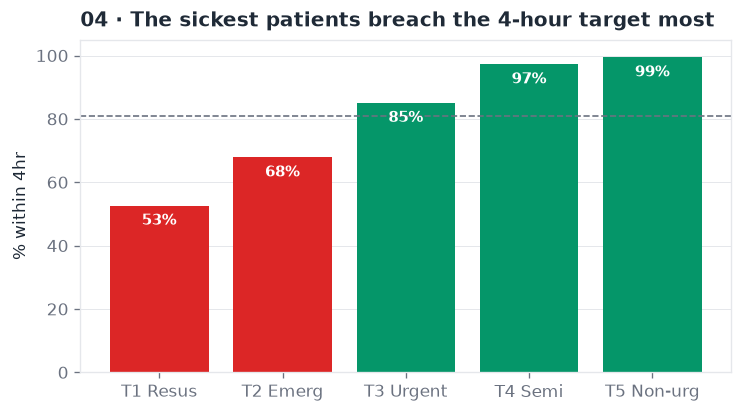

**The headline finding.** Overall 4-hour performance is 90%, but broken down by
acuity it inverts: **T1 resuscitation patients are seen within four hours only
53% of the time**, versus 99% for non-urgent T5. Reported as one blended number,
the KPI *hides* a clinical-risk problem in exactly the patients who matter most.
The combined T1–T2 figure is **66.5%**.

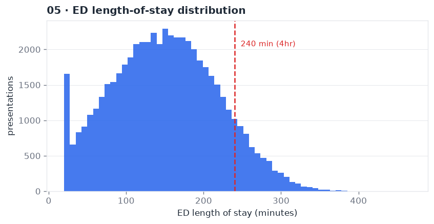

Most stays cluster under the 240-minute line, but a meaningful right tail breaches
it. Those breaches are not random — they concentrate in high-acuity, admitted
patients (next figure).

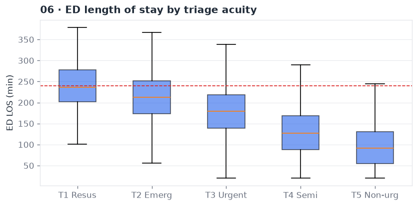

Median ED length of stay rises monotonically with acuity: T1–T2 patients sit near
or beyond the 4-hour line, while T4–T5 clear quickly. Since high-acuity patients
are also the most likely to be admitted (§5), this points to **access block /
inpatient bed availability**, not triage speed, as the bottleneck.

## 3. Arrival patterns & staffing

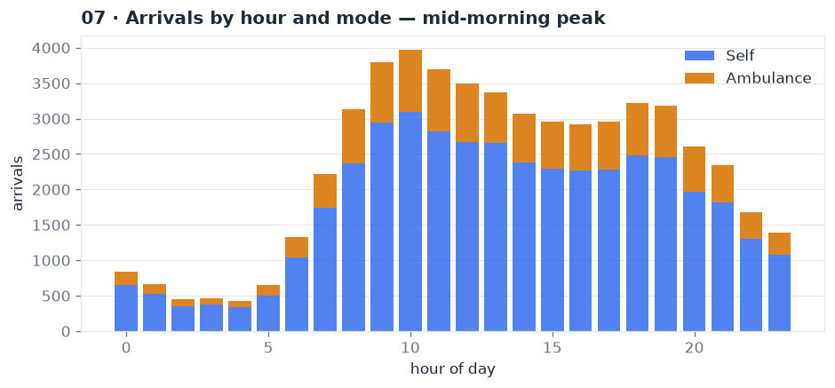

Arrivals ramp from ~07:00, peak **09:00–13:00**, and taper through the evening.
Rostering senior decision-makers to this curve — rather than a flat shift
pattern — is the cheapest lever on flow.

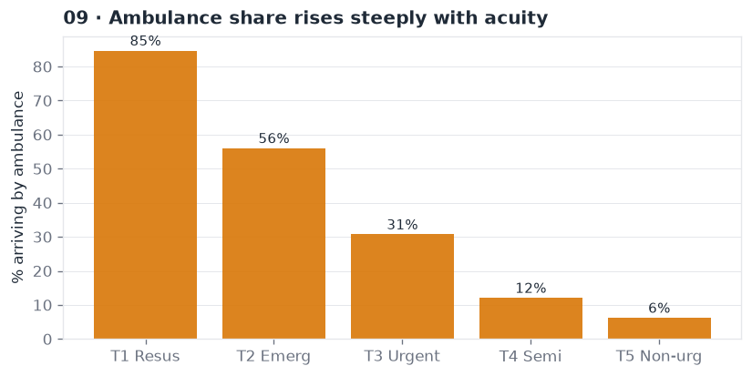

Ambulance share climbs steeply with acuity: **~85% of T1** arrivals are by
ambulance versus a small fraction of T5. Ambulance arrival is therefore a useful
real-time proxy for incoming high-acuity load and ramping risk.

## 4. Quality — patients who leave

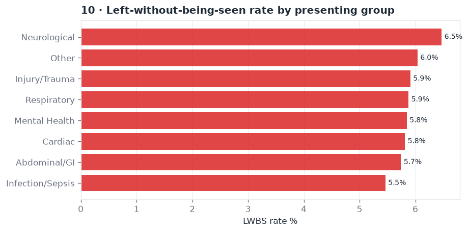

**Left-without-being-seen (LWBS)** averages 5.9% — above the <5% quality target.
It is concentrated in lower-acuity presenting groups (Neurological, Other,
Injury) that wait longest when the department is busy. LWBS is both a patient-
safety and an access-equity signal.

## 5. Admissions & inpatient flow

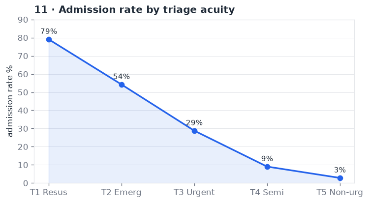

Admission likelihood scales sharply with acuity — **~79% for T1 down to ~3% for
T5**. This is why the 4-hour breaches sit with high-acuity patients: they need an
inpatient bed, and flow depends on the *ward*, not the ED front door.

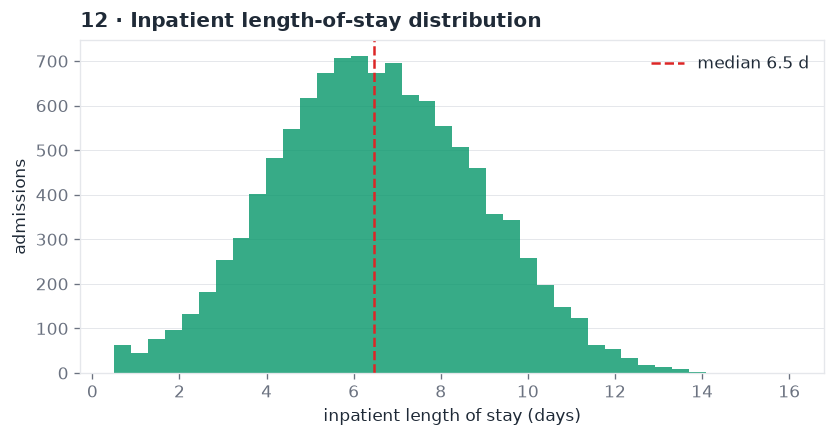

Inpatient length of stay is right-skewed with a **median of 6.5 days** and a long
tail of complex, longer-stay patients — the cohort where discharge planning and
step-down capacity pay off most.

## 6. Readmissions

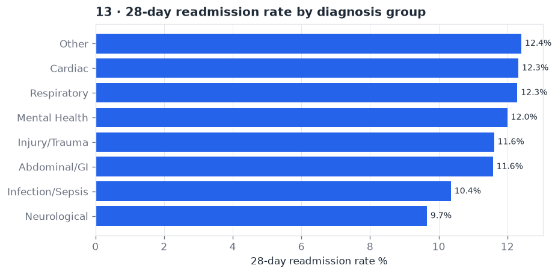

**28-day readmission** averages 11.7%, highest in **Cardiac and Respiratory**
(~12.3%). These are the classic chronic-disease groups where discharge quality,
follow-up, and community care most affect whether a patient comes back.

## 7. High utilisers

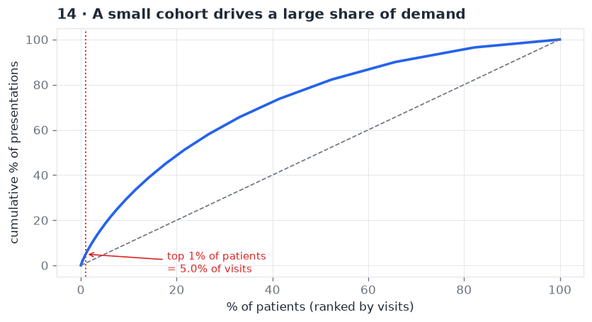

Demand is concentrated: the **top 1% of patients account for 5.0% of all
presentations**, averaging 25 visits and 6.3 chronic conditions each. The same
high-comorbidity cohort drives readmissions (§6), so a single care-coordination
intervention moves two KPIs at once.

## 8. Conclusions

| Theme | Evidence | So what |
|:------|:---------|:--------|
| Blended KPI hides risk | T1 4-hr = 53% vs 90% overall | Report NEAT **by triage** |
| Winter is plannable | −5.2pp performance Jun–Aug | Pre-load seasonal capacity |
| Bottleneck is beds, not triage | admit rate 79% (T1) drives breaches | Fix access block / bed flow |
| Small cohort, big demand | top 1% = 5% of visits | Care-coordination pathway |

Four costed recommendations with a KPI scorecard →
[**healthcare-ed-analytics/docs/business_recommendations.md**](healthcare-ed-analytics/docs/business_recommendations.md)

---

## Repository contents

| Path | What |
|:-----|:-----|
| [`healthcare-ed-analytics/`](healthcare-ed-analytics) | **Featured** — the full ED project (data, SQL, dashboard, docs) |
| [`healthcare-ed-analytics/sql/`](healthcare-ed-analytics/sql) | Star-schema DDL + 7 business queries (CTEs, window functions) |
| [`healthcare-ed-analytics/dashboard/`](healthcare-ed-analytics/dashboard) | Dashboard image + Power BI build guide + DAX measures |
| [`other/`](other) | Archived / unrelated files (thesis code, posters, older web page) |

**Skills:** SQL (joins, CTEs, window functions, star-schema modelling) · Python
(pandas, numpy, matplotlib) · BI (Power BI, DAX) · Statistics (R) · Australian
healthcare metrics & patient-flow analysis.

---

*All datasets in the featured project are synthetic and contain no real patient
records — they exist to demonstrate the analytical workflow, not to describe any
real health service.*
