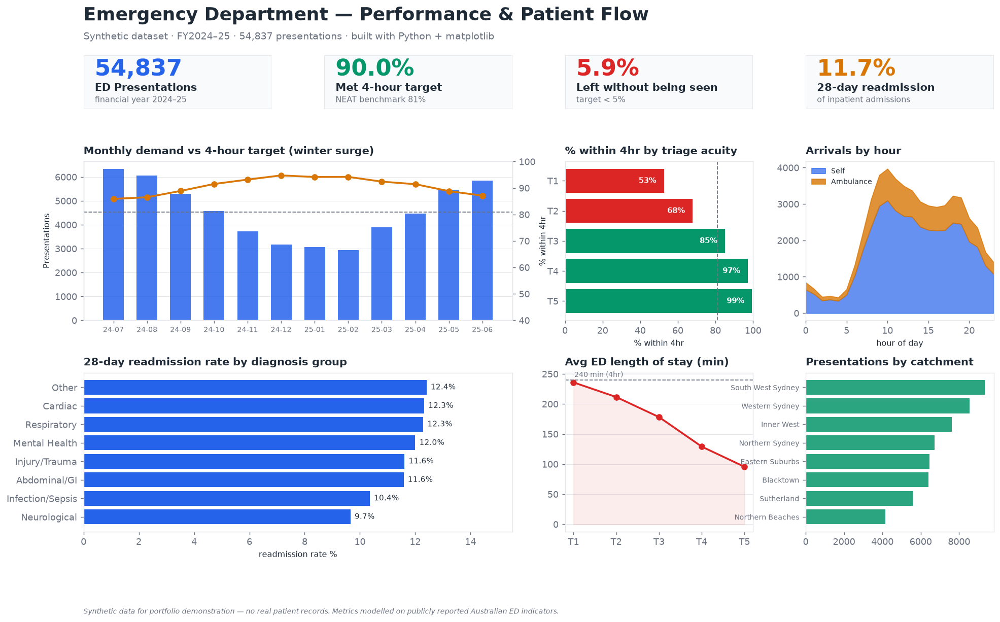

# Data Analytics Portfolio

Health & business data analytics projects — SQL, Python, and BI dashboards,
built around real-world questions for **health data analyst** roles.

Each project is end-to-end: data → analysis → dashboard → recommendations.

---

## ⭐ Featured — Emergency Department & Patient Flow Analytics

**[→ healthcare-ed-analytics/](healthcare-ed-analytics)**

An end-to-end healthcare analytics project on 54,837 synthetic ED presentations,
modelling the metrics Australian health services actually track (NEAT 4-hour
target, triage performance, LWBS, 28-day readmissions, patient flow).

- **SQL** — star schema + 7 business queries (CTEs, window functions) · [`sql/`](healthcare-ed-analytics/sql)
- **Dashboard** — rendered from data + a full [Power BI build guide](healthcare-ed-analytics/dashboard/powerbi_build_guide.md) with [DAX measures](healthcare-ed-analytics/dashboard/dax_measures.md)
- **Recommendations** — four costed actions with a KPI scorecard · [`docs/`](healthcare-ed-analytics/docs/business_recommendations.md)
- **Headline insight** — the sickest patients (T1) meet the 4-hour target only **53%** of the time vs 99% for non-urgent, a clinical-risk signal hidden by the blended 90% KPI.

---

## Other work

| Project | Focus | Stack |
|:--------|:------|:------|
| [`SQL/`](SQL) *(branch: `sql-tiktok-gbs-agency-analysis`)* | Multi-dimensional ad-spend analysis | SQL, window functions |
| `Postgraduate thesis code.Rmd` | Statistical analysis (pre-aging study) | R, R Markdown |

---

## Skills

**SQL** (joins, CTEs, window functions, star-schema modelling) ·
**Python** (pandas, numpy, matplotlib) ·
**BI** (Power BI, DAX) ·
**Statistics** (R) ·
**Domain** (Australian healthcare metrics & patient-flow analysis)

*All datasets in the featured project are synthetic and contain no real patient
records — they exist to demonstrate the analytical workflow.*
