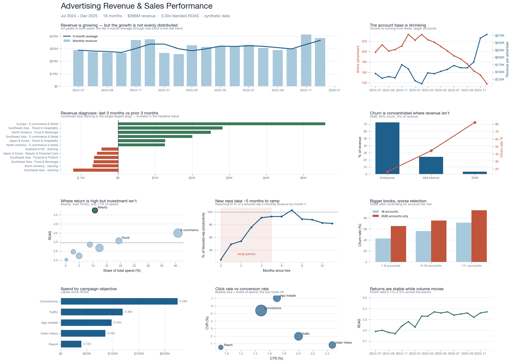

# Advertising Revenue & Sales Performance Analytics

**SQL · Tableau · Python** — an end-to-end business analysis of a digital
advertising sales organisation: 340 advertisers, 42 sales reps, 3,143
campaigns and 195,488 campaign-days of delivery data over 18 months.

The question the project answers: **revenue is growing — so why is that a
problem?**



> **Interactive Tableau dashboard:** *[add your Tableau Public link here]*
> — build it from [`dashboard/tableau_build_guide.md`](dashboard/tableau_build_guide.md)

---

## The finding

Revenue grew 9.9% half-over-half. Underneath that:

- **Active advertisers fell 31%** (199 → 138) while revenue per advertiser rose
  **93%**. All growth is expansion on a contracting base.
- **Southeast Asia Gaming contracted 33.7%**, taking 7.0 points off the total
  change — invisible in the headline trend, and independently corroborated by a
  separate churn-risk query in which 5 of the top 10 at-risk accounts are SEA
  Gaming.
- **Book size measurably damages retention**: reps with 17+ accounts lose 71%
  of their book vs 43% for reps with 1–8 — and the effect is *stronger* after
  controlling for account-tier mix, so it is not a composition artifact.
- **Beauty & Personal Care returns 4.75x ROAS on 10.7% of spend**, against a
  2.95x average. The clearest growth opportunity in the book.

Full write-up with recommendations and stated limitations →
**[`docs/business_recommendations.md`](docs/business_recommendations.md)**

---

## What's in here

```
ads-revenue-analytics/
├── data/
│   ├── generate_data.py        synthetic data generator (seeded, reproducible)
│   ├── advertisers.csv         340 advertisers, 5 regions, 8 verticals, 3 tiers
│   ├── sales_reps.csv          42 reps with hire dates and seniority
│   ├── campaigns.csv           3,143 campaigns across 5 objectives
│   └── daily_performance.csv   195,488 campaign-days of delivery
├── sql/
│   ├── 01_schema.sql           star schema, constraints, denormalised view
│   └── 02_analysis.sql         12 business questions
├── analysis/
│   ├── run_analysis.py         runs the SQL, exports Tableau extracts
│   └── build_dashboard.py      renders the dashboard image above
├── dashboard/
│   ├── extracts/               12 Tableau-ready CSVs
│   ├── tableau_build_guide.md  step-by-step build instructions
│   └── calculated_fields.md    every Tableau calculation, with reasoning
└── docs/
    └── business_recommendations.md
```

---

## The SQL

Twelve queries in [`sql/02_analysis.sql`](sql/02_analysis.sql), ordered the way
a monthly business review runs — *what happened → why → who → what next*:

| | Question | Techniques |
|---|---|---|
| Q1 | Executive KPI summary with MoM movement | CTEs, `LAG`, guarded rate maths |
| Q2 | Revenue trend, moving average, running total | `AVG OVER` with explicit frame, `SUM OVER` |
| Q3 | **Revenue diagnosis** — which segments moved | Conditional aggregation, contribution-to-change |
| Q4 | Advertiser cohort retention | Cohort self-join, `DATE_DIFF`, pivot via `CASE` |
| Q5 | Retention and revenue by account tier | Multi-CTE join, share-of-total window |
| Q6 | Advertiser value deciles and Pareto curve | `NTILE`, running total window |
| Q7 | Sales rep scorecard | `RANK`, partitioned rank, `MEDIAN` as window |
| Q8 | New-hire ramp curve | Date arithmetic, cross-join baseline |
| Q9 | Does book size hurt retention? | Conditional aggregation with confound controls |
| Q10 | Campaign funnel by objective | Nested aggregate windows, funnel rates |
| Q11 | Growth opportunity matrix | Window benchmarks, CASE-based classification |
| Q12 | Churn-risk watchlist | Period comparison, materiality thresholds |

**Engine:** DuckDB — zero-config, reads CSV natively, and its SQL dialect is
close enough to Postgres/Snowflake/BigQuery to port with minor changes.
DuckDB-specific syntax (`QUALIFY`, `read_csv_auto`) is flagged in comments where
it appears.

Two things the queries do deliberately, because they are where this kind of
analysis usually goes wrong:

- **Every denominator is `NULLIF`-guarded.** A campaign-day with impressions
  and zero clicks is normal; an unguarded CTR divides by zero somewhere in
  195,000 rows.
- **Confounds are handled, not ignored.** Q9's book-size finding would be
  meaningless without controlling for tier mix, and Q4's cohort denominator is
  taken from the advertiser dimension rather than month-0 spenders — the
  shortcut version reports retention above 100%.

---

## Running it

Requires Python 3.11+.

```bash
python -m venv .venv && source .venv/bin/activate
pip install -r requirements.txt

python data/generate_data.py       # regenerate the dataset (optional — CSVs are committed)
python analysis/run_analysis.py    # build DuckDB, run 12 queries, export extracts
python analysis/build_dashboard.py # render the dashboard image
```

Then build the Tableau workbook following
[`dashboard/tableau_build_guide.md`](dashboard/tableau_build_guide.md) and
publish to Tableau Public.

All randomness is seeded (`SEED = 20260218`), so every number in this README and
in the recommendations document reproduces exactly.

---

## About the data

Synthetic, and deliberately so — advertiser-level revenue is commercially
confidential and never public. The generator builds in six business patterns
for the analysis to find, rather than producing random noise: Q4 seasonality, a
segment-level demand shock, tier-differentiated churn, a sales-rep ramp curve, a
book-size retention penalty, and an under-invested high-return vertical.

Getting those patterns to actually survive into the data took more work than
generating the data did. Two rounds of the generator produced statistically
dead findings — a segment too thin to carry a trend, and a book-size effect
resting on a two-rep comparison — and both were diagnosed and fixed rather than
written up as results. The reasoning is documented in the generator's comments,
since it is the part of the process that matters most: **an analysis is only as
trustworthy as the check that its finding is real.**

Details: [`data/README.md`](data/README.md)
