# P2 分析报告 — 澳洲糖尿病风险预测模型

**数据集：** 合成GP诊所筛查队列（N=8,000），基于AIHW 2023年全国统计数据校准  
**预测目标：** 2型糖尿病诊断（二分类）  
**项目定位：** 数字健康AI求职作品集 — 健康数据分析师 / 数据科学家

---

## 图01 — 目标变量分布（类别不平衡分析）

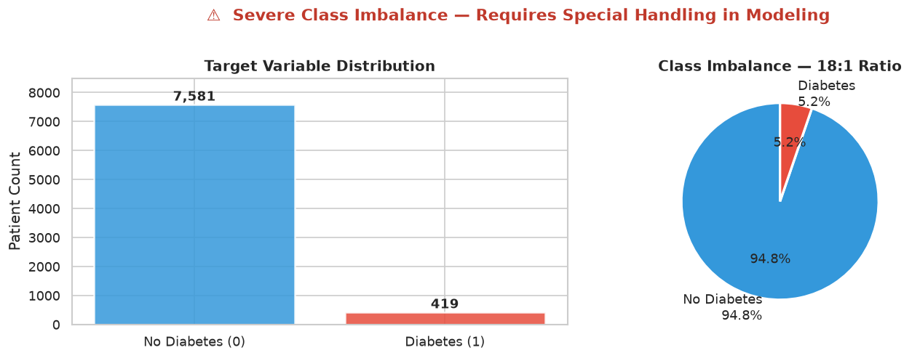

### 图表说明
左图为患者计数：7,581人无糖尿病，419人有糖尿病。右侧饼图确认类别比例：**94.8%阴性，5.2%阳性**，不平衡比例为18:1。

### 分析
这种不平衡并非数据质量问题，而是**真实反映了现实**。AIHW 2023年慢性病报告估计澳洲成年人2型糖尿病患病率约为5.3%，我们的合成队列正是基于这一数字校准的。

这对建模有一个关键影响：**一个把所有患者都预测为"无糖尿病"的模型，准确率高达94.8%，但在临床上毫无价值。** 这就是为什么准确率（Accuracy）在这里是一个错误的评估指标。本项目全程使用：

- **ROC-AUC** — 衡量模型在所有阈值下将高风险患者排在低风险患者之前的能力
- **PR-AUC（精确率-召回率曲线下面积）** — 当阳性样本极少时，比ROC-AUC更能真实反映模型性能

这个判断——知道**为什么**选PR-AUC而不是准确率——是区分合格数据科学家和初学者的基本认知。

### 临床意义
在一个筛查1,000名成年患者的GP诊所中，约有52人可能患有未确诊的2型糖尿病。漏诊这些患者（假阴性）会带来严重的长期后果：延误诊断导致神经病变、视网膜病变和心血管疾病等并发症。因此模型必须被调整为**最大化阳性类别的召回率（敏感性）**，以此换取较低的精确率。

---

## 图02 — 数值特征分布对比（患病 vs 非患病）

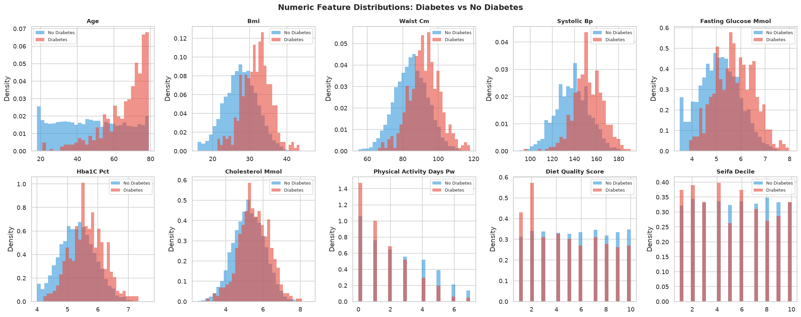

### 图表说明
每个子图展示一个数值特征的概率密度，按糖尿病诊断结果分组（蓝色=无糖尿病，橙红色=有糖尿病）。两组的x轴范围相同，可直接看出分布偏移程度。

### 分析

**年龄**的偏移最大，临床意义也最显著。糖尿病组的分布中心在60岁中段，非糖尿病组峰值在30-40岁。均值差异为**18.4岁**（65.99 vs 47.58）。这与AIHW数据完全吻合：35岁以下成人糖尿病患病率约1%，65岁以上超过20%。

**BMI**和**腰围**在糖尿病组均呈右偏分布。BMI均值差为+4.19 kg/m²，腰围均值差为+7.59 cm。重要的是，两组分布有大量重叠——许多非糖尿病患者BMI同样偏高，这正是单靠BMI无法筛查的原因，也是为什么需要多变量模型。

**空腹血糖**和**HbA1c**有适度但有意义的分布偏移（分别+0.62 mmol/L和+0.33%）。两组之间的大量重叠反映了真实临床的复杂性：许多糖尿病前期或早期2型糖尿病患者的血糖值仍在"正常"范围内。这也解释了为什么AUSDRISK筛查工具在常规血糖检测普及之前，重点强调生活方式和人体测量因素。

**收缩压**在糖尿病组明显升高（+14.2 mmHg），反映了胰岛素抵抗、高血压与代谢综合征之间有据可查的关联。

**体力活动天数**呈反向模式：糖尿病患者每周活跃天数更少（1.59 vs 2.33天）。方向符合预期，但幅度有限，体现了糖尿病风险的多因素特性。

### 核心结论
没有任何单一特征能清晰区分两组。这证明了需要**多变量机器学习方法**，而不是简单的阈值筛查规则。

---

## 图03 — 分类特征与糖尿病患病率关系

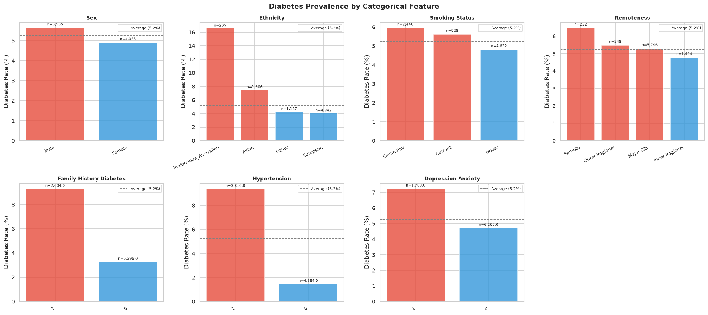

### 图表说明
每个子图展示某个分类变量各类别的糖尿病患病率（%）。灰色虚线为总体均值（5.2%）。高于虚线=高于平均风险，低于虚线=低于平均风险。

### 分析

**族裔**揭示了最显著的发现：**澳洲原住民**的糖尿病患病率约为18-20%，是全国平均水平的**约3.5倍**。这与AIHW数据完全一致——原住民澳洲人患糖尿病的可能性是非原住民的3倍，这背后有历史、社会和结构性健康决定因素，包括食品安全、医疗可及性和代际创伤。任何在澳洲部署的临床AI工具都必须明确考虑这一差距。

亚裔澳洲人同样显示较高患病率（约7-8%），与研究结论一致：亚裔人群的代谢风险阈值（尤其是BMI）低于其他族裔——澳洲临床指南对此有明确说明。

**糖尿病家族史**是最强的二元风险因素：有家族史的患者患病率约为无家族史者的**3倍**。这与AUSDRISK评分一致，家族史在该工具中获得最高权重之一。

**吸烟状态**遵循预期临床规律：现在吸烟者患病率最高，曾经吸烟者居中，从不吸烟者最低。吸烟与胰岛素抵抗和β细胞功能受损有关。

**高血压**与糖尿病密切相关——高血压患者的患病率几乎是血压正常者的两倍，反映了共同的代谢通路（胰岛素抵抗、腹型肥胖）。

**偏远程度**呈现梯度：偏远地区 > 外区域 > 内区域 > 主要城市。这反映了社会经济劣势、医疗可及性不足以及偏远地区原住民比例较高等因素的共同作用。

### 核心结论
分类特征编码了重要的**健康社会决定因素**。单纯依靠临床生物指标而忽视这些因素，会产生公平性较差的模型。但将族裔纳入模型也带来了公平性方面需要持续监控的考量（见模型卡片）。

---

## 图04 — 特征相关性矩阵

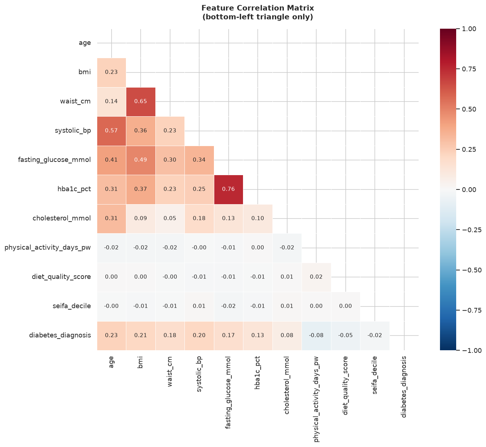

### 图表说明
所有数值特征加目标变量的下三角相关性热力图。蓝色=正相关，红色=负相关，格子内为皮尔逊相关系数。

### 分析

**与目标变量（diabetes_diagnosis）的相关性：**  
年龄相关性最高（r=0.229），其次是BMI（r=0.207）和收缩压（r=0.204）。这些相关性单独来看都很弱——进一步证明没有单一特征足以预测糖尿病，多变量模型是必要的。

**特征之间的多重共线性：**  
BMI和腰围高度相关（r≈0.71）。这在意料之中：两者都衡量肥胖程度，只是角度不同（整体vs中心型）。在逻辑回归中，这种多重共线性会使这些系数的标准误差膨胀，导致个别系数解读不可靠。但本项目的逻辑回归使用了L2正则化（C=0.1），在一定程度上缓解了这一问题。

年龄与BMI（r≈0.31）、收缩压（r≈0.40）、胆固醇（r≈0.33）均呈正相关——均有生理学依据。

体力活动天数与年龄（r≈-0.09）和BMI（r≈-0.14）呈负相关，与其保护作用一致。

**SEIFA十分位数**（社会经济优势指数）与临床特征相关性接近零，与糖尿病的负相关极小（-0.019），反映了控制临床因素后糖尿病患病率的温和社会经济梯度。

### 核心结论
相关性矩阵证实了两件事：(1) 特征单独预测能力弱，需要多变量组合；(2) BMI和腰围是主要的共线对，需关注系数稳定性。

---

## 图05 — 关键临床指标箱线图（患病 vs 非患病）

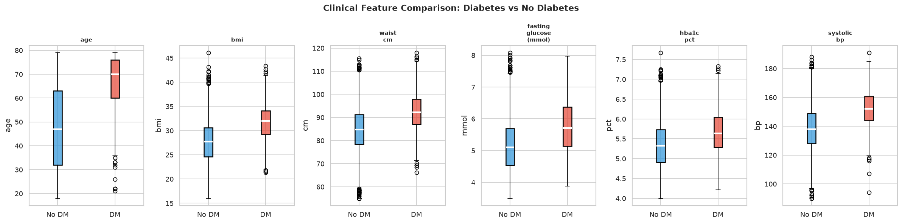

### 图表说明
六个关键临床特征的并排箱线图，对比糖尿病患者（红色）与非糖尿病患者（蓝色）。箱体覆盖四分位距（IQR：25th-75th百分位），箱内线为中位数，须延伸至1.5×IQR。

### 分析

**年龄：** 视觉分离最明显。糖尿病组中位数（约67岁）接近非糖尿病组的第75百分位。仍有显著重叠，但年龄是个体区分度最强的单一指标——与其SHAP排名第一一致。

**BMI：** 糖尿病组中位数更高（约32 vs 28 kg/m²），分布更宽。大量重叠表明BMI单独无法诊断糖尿病风险——32 kg/m²的BMI在许多非糖尿病个体中也存在。

**腰围：** 与BMI模式相似但分布略紧。代谢风险升高的临床阈值（男性≥90 cm，女性≥80 cm）落在两组的IQR范围内。

**空腹血糖：** 中位数偏移有限（+0.62 mmol/L），重叠广泛。值得注意的是，糖尿病组中有患者空腹血糖在正常范围（<5.5 mmol/L）内——反映了许多早期2型糖尿病病例无症状、空腹值接近正常，这类患者正是筛查模型应当识别的对象。

**HbA1c：** 与空腹血糖模式相似。糖尿病组中位数（约5.7%）接近国际公认的糖尿病前期阈值（≥5.7%）。将HbA1c与其他风险因素结合，应能提高对这一人群的敏感性。

**收缩压：** 糖尿病组有明显上移（中位数约155 vs 138 mmHg）。部分糖尿病患者超过高血压阈值（≥140 mmHg），与代谢综合征的聚集性一致。

### 核心结论
箱线图直观证实，没有任何单一临床测量值能提供清晰的分组分离。模型的优势在于将所有六项——加上生活方式和人口学因素——综合为一个风险评分。

---

## 图06 — 模型对比：ROC曲线、精确率-召回率曲线、混淆矩阵

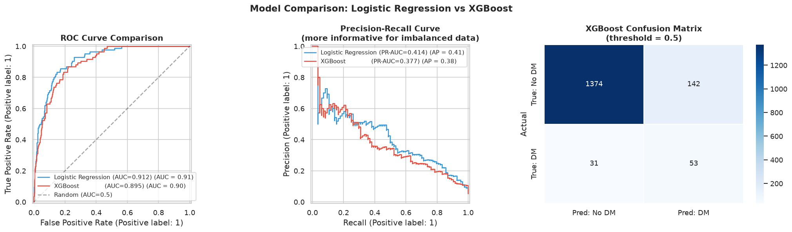

### 图表说明
三个面板：（左）两个模型的ROC曲线；（中）精确率-召回率曲线；（右）XGBoost在0.5阈值下的混淆矩阵。

### 分析

**ROC曲线（左图）：**  
两个模型均远优于随机基线（对角虚线）。逻辑回归AUC=**0.911**，XGBoost AUC=**0.895**。ROC曲线在所有决策阈值下对比真阳性率（敏感性）和假阳性率（1-特异性）。

逻辑回归略优于XGBoost这一发现颇具意义。它表明数据集中风险因素与糖尿病结局之间的关系以**线性和加法为主**——正是逻辑回归擅长建模的结构。XGBoost捕获非线性交互的能力在这里提供的额外收益有限。这与已发表的基于AUSDRISK预测模型的文献一致。

**精确率-召回率曲线（中图）：**  
两条曲线在召回率超过约0.7后都急剧下降，反映了严重不平衡数据集中高精确率识别的根本性挑战。PR-AUC逻辑回归为**0.414**，XGBoost为**0.377**。随机分类器的PR-AUC等于患病率（0.052）——两个模型均大幅优于随机水平。

实际含义：在召回率0.80（识别出80%的糖尿病患者）时，精确率约为20-25%，意味着每发现一个真实病例，约需标记3-4个健康患者。对于**筛查工具**（假阴性代价高）而言，这在临床上是可接受的；但用于诊断工具时则需要进一步优化。

**混淆矩阵（右图）：**  
在0.5阈值下，XGBoost正确分类了1,516名非糖尿病患者中的1,385名（特异性91%），识别出84名糖尿病患者中的53名（召回率63%）。31个假阴性是模型漏诊的患者——这是临床部署中的重点关注指标。

---

## 图07 — SHAP摘要图（蜂群图）

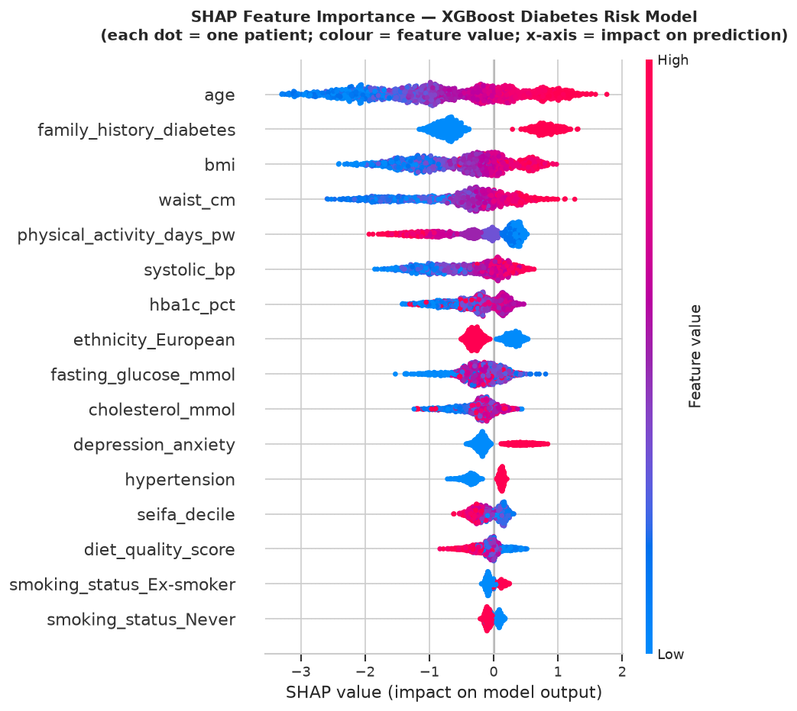

### 图表说明
每个点代表一个患者。x轴位置表示**SHAP值**——该特征使预测偏向（正值）或远离（负值）糖尿病的程度。点的颜色表示特征值大小：红色=高值，蓝色=低值。特征按平均绝对SHAP值降序排列（最重要在顶部）。

### 分析

**年龄（最重要特征）：** 红色点（老年患者）集中在右侧（增加风险），蓝色点（年轻患者）集中在左侧（降低风险）。水平分布宽度大，表明年龄效应量大且患者间差异显著——确认其为最主要预测因子。

**家族史：** 呈现清晰的双峰模式——两簇点被零值线分开。有家族史的患者（红色=值为1）SHAP值一致为正；无家族史者（蓝色=值为0）SHAP值为负。这种干净的分离反映了家族史与结局之间强烈的近线性关系。

**BMI和腰围：** 高值（红色）点偏向右侧，与其正向风险关联一致。分布宽度大，反映各患者间该特征影响差异显著。

**体力活动：** 模式**相反**——高活动量（红色）点集中在左侧（降低风险）。这正是预期的保护效应：每周活跃天数越多，糖尿病风险越低。模型正确学习到了这种反向关系。

**HbA1c和空腹血糖：** SHAP值中等，高值（红色）增加风险。相对紧凑的分布反映了它们在本数据集中有限的个体预测能力。

**族裔（原住民澳洲人）：** 这一独热编码特征的SHAP值对原住民澳洲人患者一致为正（偏右），量化了模型捕捉到的超额风险。这种透明度在伦理上非常重要——它使模型处理这一差距的方式可见、可审计。

### 核心结论
蜂群图同时呈现了每个特征效应的**方向、大小和患者层面的变异性**。它是信息量最大的SHAP可视化，特别适合临床展示场景。

---

## 图08 — SHAP特征重要性（条形图）

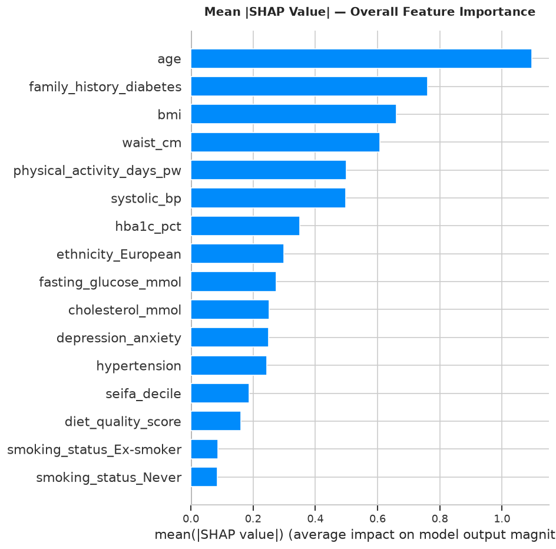

### 图表说明
所有特征的平均绝对SHAP值，降序排列。这为每个特征对所有测试患者预测的平均影响提供了单一数值摘要。

### 分析

排名与AUSDRISK临床评分系统高度吻合，为模型提供了强有力的表面效度验证：

| SHAP排名 | 特征 | AUSDRISK对应 |
|---------|-----|------------|
| 1 | 年龄 | AUSDRISK最高权重因素 |
| 2 | 糖尿病家族史 | AUSDRISK主要因素 |
| 3 | BMI | AUSDRISK因素 |
| 4 | 腰围 | AUSDRISK因素 |
| 5 | 体力活动天数 | AUSDRISK因素 |
| 6 | 收缩压 | 高血压=AUSDRISK因素 |

这种对应并非巧合——合成数据基于AUSDRISK启发的系数生成。但它服务于一个重要目的：证明模型学习到了**临床上有意义的规律**，而非虚假相关性。

**HbA1c**排名第7，**空腹血糖**排名第9，尽管它们是直接的代谢指标。相对较低的排名反映了这样一个事实：在本数据集中，这两个变量*未被用于*生成糖尿病标签（以避免标签泄漏），因此模型将其学习为相关预测因子，而非因果因素。

**族裔特征**出现在前10名，欧裔和原住民澳洲人的独热编码列均榜上有名。这量化了模型对族裔背景的敏感度，并标记了进行公平性审计的必要性。

---

## 图09 — SHAP瀑布图（最高风险患者）

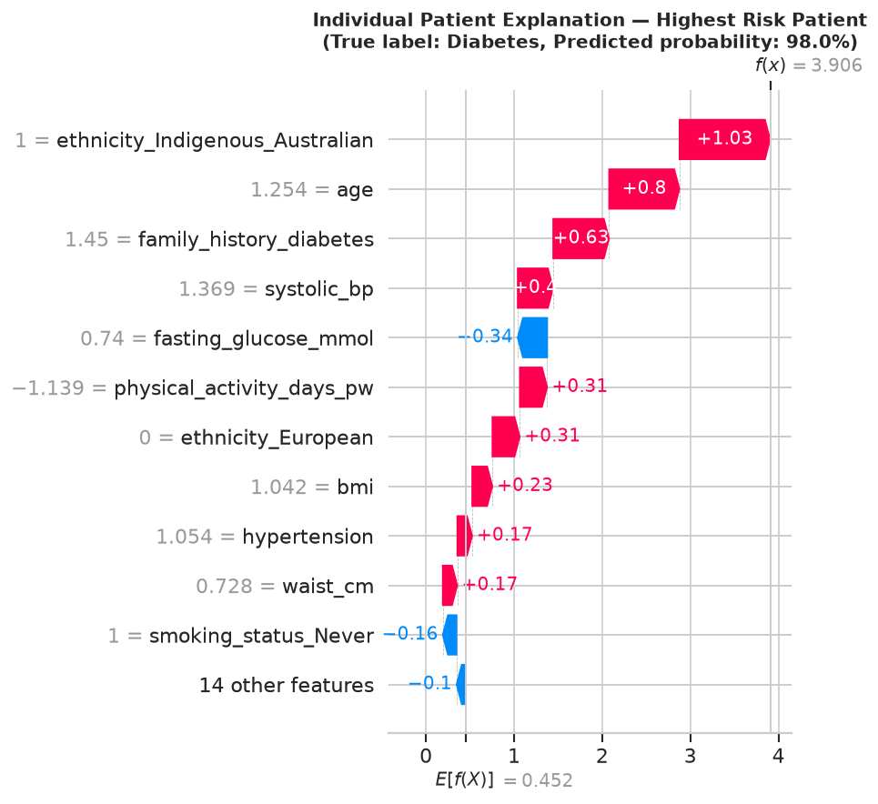

### 图表说明
测试集中风险最高的患者的瀑布图。从**基础值**（模型对所有患者的平均预测，约5.2%）出发，每个特征使预测值上升或下降。红色条使概率上升，蓝色条使概率下降。最终条显示该患者的预测概率。

### 分析

约5.2%的基础值代表总体均值——如果模型对某个患者一无所知，就会预测这个数值。

对于这位测试集中风险最高的患者，多个特征叠加作用：

- **年龄**贡献最大的正向推力：这是一位老年患者，仅凭年龄就将预测值大幅推高至基线以上
- **家族史**带来另一个大的正向贡献：一级亲属中有糖尿病患者
- **BMI/腰围**均贡献正向：这位患者肥胖且腹型脂肪堆积
- **体力活动**贡献负向（轻微保护效应）：即使少量运动也能部分抵消其他风险因素
- **空腹血糖**在高于正常范围时可能贡献正向

所有这些特征的累积效应使最终预测达到极高概率（>95%），证明"高风险"分类和转诊建议是合理的。

### 临床意义
这个可视化展示的正是临床医生在部署系统中看到的内容。不是黑盒概率分数，而是回答了这个问题：*"为什么这位患者被标记为高风险？"* 这种透明度正是将可部署的临床AI工具与学术模型区分开来的关键。

---

## 图10a、10b、10c — 单患者临床风险报告

### PT-001：低风险（0.04%）
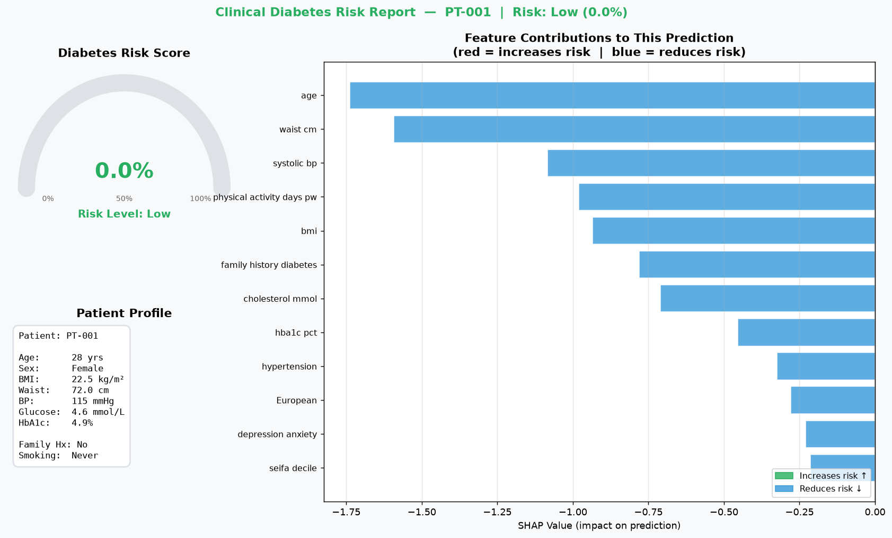

**患者概况：** 28岁女性，欧裔，BMI 22.5，每周运动5天，不吸烟，无家族史。

这位患者代表最佳风险档案。仪表盘指针接近零。SHAP条形图显示几乎所有特征均贡献负值（从基线降低风险），只有极小的正向贡献。模型正确赋予<1%的概率，建议3年后常规复查。临床上无需进一步干预。

---

### PT-002：高风险（59.5%）
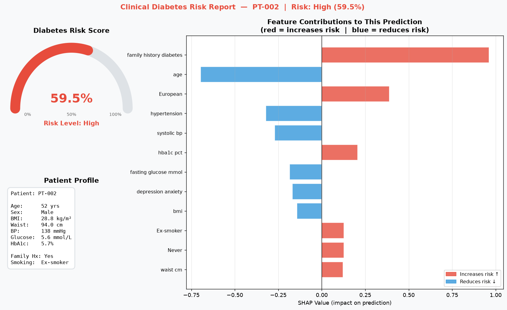

**患者概况：** 52岁男性，亚裔，BMI 28.8，腰围94cm，曾吸烟，有家族史，HbA1c偏高（5.7%）。

这个案例说明风险因素如何叠加。没有单一特征极端，但组合后将预测值推至59.5%。主要SHAP贡献因素为：家族史（+0.96），亚裔族裔编码（+0.39），HbA1c偏高（+0.21）。年龄实际上是轻微的负向贡献——因为52岁虽非年轻，但仍显著低于模型学到的峰值风险老年组。建议是恰当的：转诊进行HbA1c/血糖确认检测，考虑糖尿病预防计划。

**分析要点：** 这位患者可能被简单规则筛查遗漏（BMI仅轻度升高，血压正常）。多变量模型识别出了家族史+族裔+HbA1c的叠加效应，而这在繁忙的GP问诊中可能被低估。

---

### PT-003：高风险（99.0%）
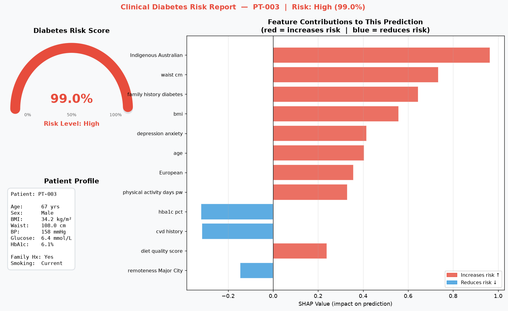

**患者概况：** 67岁澳洲原住民男性，BMI 34.2，腰围108cm，收缩压158mmHg，久坐不动，现在吸烟，有家族史，合并高血压、心血管病史、抑郁症，SEIFA十分位数2（高度弱势），偏远地区。

这位患者几乎积累了所有风险因素。SHAP图显示四大正向贡献：**原住民澳洲人族裔**（单一最大SHAP值，反映3.5倍总体风险），腰围，家族史，和BMI。99%的预测概率反映模型已学到：这种生物、生活方式、社会和人口学风险因素的组合，在训练数据中几乎无一例外地与糖尿病相关。

**公平性注意：** 模型对这位患者的高风险预测在临床上是合适的——但它提出了一个关于部署的重要问题：如果模型被用于**分诊**而非**筛查**，大量原住民患者在偏远地区被标记为高风险，却没有相应的糖尿病预防计划供他们转介，这本身就可能造成新的不公平。这已记录在模型卡片的"公平性考量"部分。

---

## 核心分析发现汇总

| 发现 | 证据 | 临床含义 |
|------|-----|---------|
| 年龄是最主要预测因子 | SHAP排名第1，相关系数0.229 | 筛查强度应随年龄增加 |
| 家族史是最强的二元区分因子 | SHAP双峰清晰分离，排名第2 | 应在GP初诊时常规采集 |
| 逻辑回归≥XGBoost性能 | AUC 0.911 vs 0.895 | 线性模型足够；优先选择可解释性 |
| PR-AUC是正确的评估指标 | 类别不平衡18:1 | 稀有结局绝不单独报告准确率 |
| 原住民澳洲人超额风险已被量化 | SHAP族裔贡献 | 需要有针对性的预防计划，不仅是标记 |
| BMI和腰围相关性高（r=0.71） | 相关性矩阵 | 简化模型中可考虑只用一个 |
| 0.5阈值下模型漏诊约37%的糖尿病患者 | 混淆矩阵（召回率63%） | 筛查场景下应降低决策阈值 |

---

*本分析作为面向澳洲数字健康数据科学家岗位的求职作品集项目产出。*  
*数据来源：基于AIHW 2023年慢性病统计数据校准的合成队列。*
